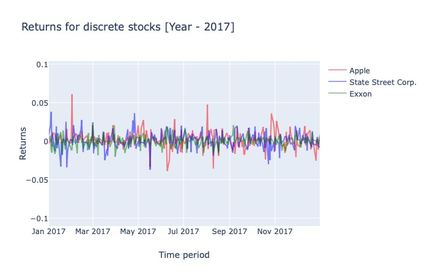
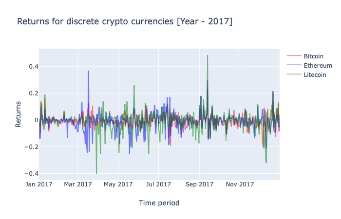

# Portfolio Optimization using Deep Reinforcement Learning
### Bishishta Mukherjee, Konanki Sai Charan, Manvita Markala, Romil Rathi
### September 30, 2019

# Summary

Financial portfolio optimization is the process of redistributing funds into multiple financial vehicles at a given timestamp in order to maximize returns while minimizing the risk at the same time. The goal in this project is to provide a solution framework which deals with this complex financial engineering problem. The framework will be implemented using a combination of machine learning and Reinforcement Learning (RL) techniques. Built RL framework will be trained and tested on stocks and crypto currency trading data.

The dataset consists of:

(i) Phase 1: Discrete data:
  Historical stocks data of ~15 assets from S&P 500 portfolio5 from 2005 to present and historical data for ~6     Cryptocurrencies from CoinMarketCap6 from 2015 to present.

(ii) Phase 2: Continuous data:
	~10 Cryptocurrency Data from Poloniex Exchange7

The price data follows the format of Open, High, Low and Close (OHLC) for a given time frame. Open is the price at which the stock begins trading, High is the highest value it attains, Low is the lowest value throughout the day and Close is the closing value. For discrete data, this time frame is one day whereas for continuous data, it’ll be about 30min. Usually, open price is equal to close price for the previous day, but cryptocurrency follows high frequency trading, thus we might not see open price for one day same as closing price for previous days. 

To estimate/approximate our profit function, three different frameworks will be built using statistical machine learning models - Convolutional Neural Network (CNN), Recurrent Neural Network (RNN), and Long Short-Term Memory (LSTM). We will be using goal oriented algorithms like deep Q-learning and Recurrent Reinforcement Learning when training the above mentioned neural network models and make them learn how to maximize the return profit over time.

# Research Plan

To scrape the financial price data, assets or holdings are selected in a way that they range across different stock sectors so as to minimize the downside risk. Some of the selected holdings are Apple Inc. from information technology sector, Boeing from industrial sector, State Street Corp. from financial sector and Facebook from communication sector. This diversification of portfolio is the most important factor in reducing the overall risk involved because when portfolio is diversified, if one asset value goes down, other might go up which rebalances it. In order to manage the sparsity in allocation of each asset in the portfolio, a small subset of financial price data is selected here.

Two major concerns have been handled during the data preprocessing step. First being data values for different stock and crypto currencies have varying ranges which might introduce bias in the models, to handle these fluctuating values, normalization was performed as follows: _close value /open value_. This ensures that the price of all the stocks fall within the same scale. Second being missing data values which were handled in two steps : 
1) Data pertaining to national holidays and weekends have been removed
2) Remaining missing values, if any, of open, low, high and close have been replaced with associated close values of previous timestamp.

To build the proposed framework, three different traditional deep learning methods [Convolution Neural Network (CNN), Recurrent Neural Network (RNN) and Long Short term Memory (LSTM)] will be used and tested against each other as the input of the neural network models is the unpredictable time series data, The assumption is that RNN might be more useful than CNN because of its bi-directional nature. But in the case of RNNs, vanishing gradient problem might arise and therefore LSTM should be used, which in general case is an improved model and shows better results. Hence, in order to experiment with the assumptions made and conclude which framework works the best in this scenario, performances of each of the three frameworks built will be evaluated using back testing and benchmarks.

The problem statement at a higher level is a RL problem where a given portfolio has certain number of assets and we are trying to allocate a certain ratio of total investment (weight) on each asset after each timestamp so as to find the optimized weight which will in turn maximize the reward by increasing our profits. The agent-environment setup is similar to the paper1. Here, the environment is the financial market, state at any timestamp t would be historical stock prices and previous timestamp’s portfolio. Action would correspond to a vector containing allocation information amongst each asset for the obtained portfolio and reward would be the profit return of investment after rebalancing the portfolio by allocation obtained in form of action.We would use the above proposed setup as a basis for the algorithms like deep Q-learning and Recurrent Reinforcement Learning to train the models.

Data science tools8 used are pandas, tensorflow, beautifulsoup, scikit-learn, plot.ly, matplotlib, seaborn and anaconda.

# Preliminary results

In order to explore the relationship between the holdings in different stock sectors, heat map has been plotted to identify the correlation between stocks for both discrete stocks and crypto currency trading data.

![Heat map for discrete stocks trading data[]{label="fig:heatmap"}](heat_map_stocks.png)
###### Figure 1: Heat map for discrete stocks trading data

As observed from Figure 1 for discrete stocks trading data, stocks for some of the companies like Apple, Amazon, Google and Boeing are highly correlated indicating the stocks always move in the same direction. This fact can be used to select assets with very less correlations for the inclusion of the portfolio to further minimize the risk factor.

  
###### Figure 2: Returns for discrete stocks

For example, the interactive plots9 represented in Figure 2 show the variation of stock returns for three holdings Apple, State Street Corp. and Exxon (for years 2016, 2017, 2018 and 2019) which show a very low correlation amongst themselves. As can be seen, majority of the times the returns move in opposite directions and hence a security factor comes into play if the portfolio is distributed amongst these low correlated assets, as the decrease in returns from one asset can be balanced by the increase in the other.

![Heat map for discrete crypto currency trading data[]{label="fig:heatmap"}](heat_map_crypto.png)
###### Figure 3: Heat map for discrete crypto currency trading data

As observed in figure 3 for discrete crypto currency trading data, crypto currencies have higher correlation than discrete stocks which is mainly due to the fact that they’ve been selected on the basis of the volume of trading on the index, that is, the crypto currencies which are performing really good in the market. The basic reason for doing so is that since crypto currency has been introduced in recent years, there is not enough data for the majority of them. In such a scenario, only the top trading one’s provide us with sufficient data to build a well trained framework. The same can be concluded from the interactive plots10 shown in the figure 4 demonstrating the variation of returns for three crypto currencies - Bitcoin, Euthereum and Litecoin (for years 2016, 2017, 2018 and 2019). As can be seen, majority of the times the returns move in the same direction.

  
###### Figure 4: Returns for discrete crypto stocks

For discrete stocks data, the total data collected is for 3671 days (excluding weekends and national holidays). But in case of crypto currency data, the total data collected varies from 1600 days to 2300 days approximately. Again, largely due to the fact that the crypto currencies were launched much later in the market. Therefore, one of the major problems to be handled while building an efficient framework here is the high sparsity and high correlation in case of crypto currency data.

# References

[1] Zhengyao Jiang, Dixing Xu, and Jinjun Liang
A Deep Reinforcement Learning Framework for
the Financial Portfolio Management Problem.
Xi’an Jiaotong-Liverpool University, Suzhou, SU
215123, P. R. China.

[2] Chi Zhang, Corey Chen, Limian Zhang
https://www-scf.usc.edu/ zhan527/post/cs599/

[3] Xin Du, Jinjian Zhai, Koupin Lv
Algorithm Trading using Q-Learning and
Recurrent Reinforcement Learning Dept. of
Computer Science, Stanford, USA.

[4] Olivier Jin, Hamza El-Saawy
Portfolio Management using Reinforcement
Learning Dept. of Computer Science, Stanford,
USA.

[5] Historical stocks data of 15 assets from
SP 500 portfolio from 2005 to present.
https://www.barchart.com

[6] Historical data for 6 Cryptocurrencies from
CoinMarketCap from 2015 to present.
https://coinmarketcap.com

[7] 10 Cryptocurrency Data from Poloniex Exchange
https://poloniex.com/

[8] Data science tools documentation:
https://docs.anaconda.com/
https://seaborn.pydata.org/
https://www.tensorflow.org/
https://www.crummy.com/software/BeautifulSoup/bs4/doc/
https://scikit-learn.org/stable/
https://plot.ly/
https://matplotlib.org/

[9] Interactive plots for discrete stock returns using Tableau:
https://public.tableau.com/profile/sai.charan.konanki#!/vizhome/StockGrouped/StockGrouped?publish=yes

[10] Interactive plots for crypto currency returns using Tableau:
https://public.tableau.com/profile/sai.charan.konanki#!/vizhome/CryptocurrencyGrouped/CryptoCurrencyGrouped?publish=yes

